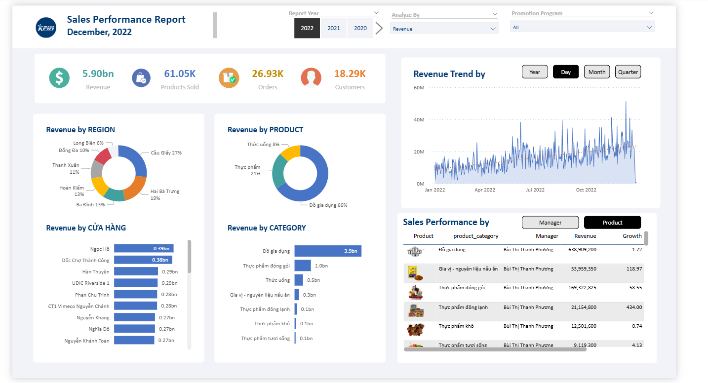
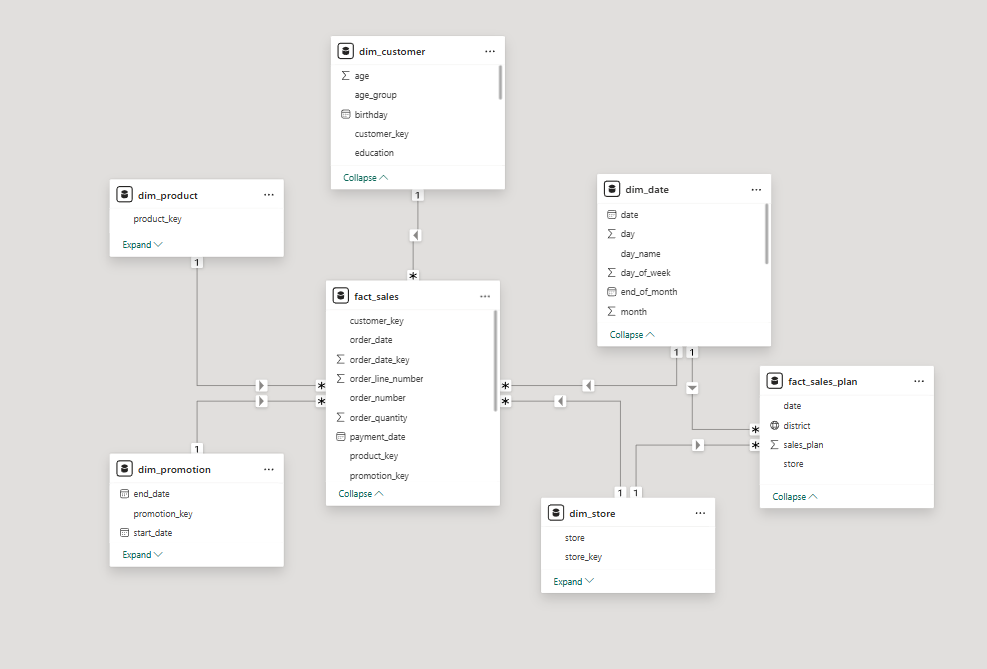
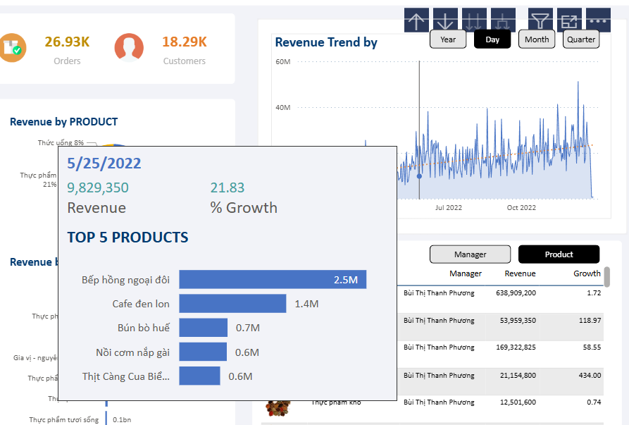

# Project Details — KPIM Mart Sales Analytics Dashboard

---

## Dashboard Preview

---

## Data Source
- Raw data provided in **Excel files**
- Loaded into Power BI via **Power Query**
- Additional columns added to several tables during transformation

---

## Data Model

The data model follows a **Snowflake Schema** with **2 Fact Tables**:
- `fact_sales` — transactional sales data
- `fact_sales_plan` — sales plan/target data

Connected to dimension tables: `dim_customer`, `dim_product`, `dim_store`, `dim_date`, `dim_promotion`

---

## DAX Measures
- **Field Parameters** — dynamically switch between KPIs (Revenue, Products Sold, Orders, Customers) across all visuals
- **Year-over-Year Growth** — calculates % growth compared to the same period last year
- **SAMEPERIODLASTYEAR** — returns KPI value from the equivalent period in the prior year
- **TOTALYTD** — cumulative year-to-date calculation
- **DIVIDE** — safe division with fallback value to avoid blank/error results
- **CALCULATE** — modifies filter context for custom aggregations
- **Parameter Growth** — measures growth rate dynamically based on selected field parameter

---

## Other Features
- **Bookmarks** — navigation and toggling between different report views
- **Slicers** — dynamic filtering by region, store, product category, promotion program, and report year
- **Custom Tooltip Pages** — additional KPI breakdowns on hover

---

## Tooltip Preview

